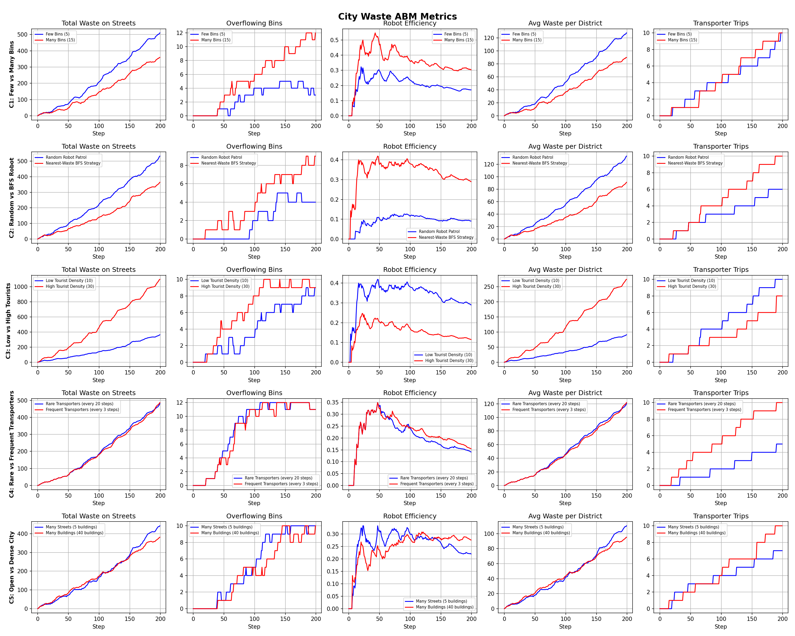

# City Waste ABM Simulation

Agent-Based Model simulating urban waste distribution using Python and Mesa. 

---

## Project Goal

Study how different types of agents and infrastructure influence the spatial 
and temporal distribution of waste in a city.

**Research Question:**
> How do city structure, movement patterns, bin placement, cleaning strategies, 
> and transporter frequency affect waste accumulation in a city?

---

## City Model

The city is a **30x30 grid** with 5 cell types:

| Cell Type | Description |
|---|---|
| Street | Agents move freely |
| Building | Blocks all movement |
| Public area | Walkable, waste accumulates |
| Bin spot | Fixed bin location |
| Disposal zone | City edges — waste permanently removed |

---

## Agent Types

| Agent | Behavior |
|---|---|
| LocalHuman | Moves home to work daily, 5% waste probability, uses nearby bins |
| Tourist | Biased toward city center, 15% waste, ignores bins |
| CleaningRobot | Random patrol OR BFS nearest-waste strategy |
| DustBin | Fixed, capacity 10 units, overflows if not emptied |
| DustTransporter | State machine: idle to bin to disposal, navigates via BFS |

---

## BFS — Graph Search Algorithm

Breadth-First Search is used for all agent navigation — guarantees shortest path.

Used in 3 agents:
- LocalHuman — shortest path to home or work
- CleaningRobot — nearest waste cell, nearest bin with space
- DustTransporter — path to fullest bin, path to disposal zone

---

## Creative Extension — Time-of-Day Cycle

A 24-step day/night cycle repeating throughout the simulation:

| Time | Steps | Effect |
|---|---|---|
| Day | 0-11 | Tourists active, robots normal speed (1 action/step) |
| Night | 12-23 | Tourists inactive, robots double shift (2 actions/step) |

---

## Experiments

5 comparisons, each isolating one variable:

| # | Comparison | Scenario A | Scenario B |
|---|---|---|---|
| C1 | Bin count | 5 bins | 15 bins |
| C2 | Robot strategy | Random patrol | BFS nearest-waste |
| C3 | Tourist density | 10 tourists | 30 tourists |
| C4 | Transporter frequency | Every 20 steps | Every 3 steps |
| C5 | City density | 5 buildings | 40 buildings |

5 metrics tracked over 200 steps:

1. Total waste on streets
2. Number of overflowing bins
3. Robot cleaning efficiency
4. Average waste per district (4 quadrants)
5. Transporter workload (trips)

---

## Results

| Comp. | Scenario | Waste | Overflow | Efficiency | Avg District | Trips |
|---|---|---|---|---|---|---|
| C1 | Few Bins (5) | 510 | 3 | 0.171 | 127.5 | 10 |
| C1 | Many Bins (15) | 359 | 12 | 0.304 | 89.8 | 10 |
| C2 | Random Patrol | 532 | 4 | 0.091 | 133.0 | 6 |
| C2 | BFS Nearest-Waste | 364 | 9 | 0.290 | 91.0 | 10 |
| C3 | Low Tourists (10) | 364 | 9 | 0.290 | 91.0 | 10 |
| C3 | High Tourists (30) | 1099 | 9 | 0.115 | 274.8 | 8 |
| C4 | Rare (every 20) | 481 | 11 | 0.141 | 120.2 | 5 |
| C4 | Frequent (every 3) | 487 | 11 | 0.155 | 121.8 | 10 |
| C5 | Many Streets (5) | 442 | 10 | 0.220 | 110.5 | 7 |
| C5 | Many Buildings (40) | 381 | 10 | 0.276 | 95.2 | 10 |



---

## How to Run

Install dependencies:

```bash
pip install -r requirements.txt
```

Run simulation:

```bash
python run.py
```

Output:
- Terminal — comparison table with all metrics
- results.png — charts showing all 5 metrics over 200 simulation steps

---

## Project Structure

```
abm_city_waste/
├── config.py          # All experiment parameters
├── city_generator.py  # Procedural city grid generation
├── agents.py          # All 5 agent classes + BFS algorithm
├── model.py           # Main Mesa simulation model
├── visualization.py   # Matplotlib charts
├── run.py             # Entry point — runs all scenarios
└── requirements.txt   # Dependencies
```

---

## Technical Details

| | |
|---|---|
| Language | Python 3.11 |
| Framework | Mesa 3.x |
| Dependencies | mesa, matplotlib|
| Reproducibility | random.seed(42) |